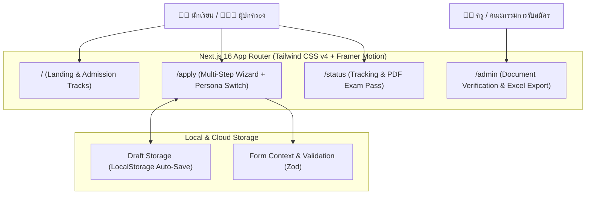
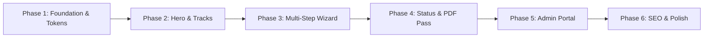
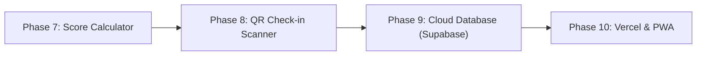

# 📋 Thasala Admission Portal — Development Plan & UI/UX Roadmap

> **เป้าหมาย:** สร้างระบบรับสมัครนักเรียนออนไลน์สำหรับ **โรงเรียนท่าศาลาประสิทธิ์ศึกษา** ที่มีความ **Dynamic**, อนิเมชันสวยงามลื่นไหล, ถ่ายทอดอัตลักษณ์สี **เทา-เหลือง** อย่างสง่างาม และที่สำคัญที่สุดคือ **ใช้งานง่าย ไม่รก ไม่ซับซ้อน** ทั้งสำหรับนักเรียนและผู้ปกครอง

---

## 🎯 ปรัชญาการออกแบบ (Design Philosophy & UX Principles)

จากแนวทาง **UI/UX Pro Max** และ **Design System**:

1. **Simplicity over Clutter (เรียบง่ายแต่ทรงพลัง):** 
   * แบ่งข้อมูลยาว ๆ ออกเป็นขั้นตอนย่อย (Progressive Disclosure) ไม่กองทุกอย่างในหน้าเดียว
   * ใช้ White Space อย่างเหมาะสม เพื่อให้สายตาโฟกัสข้อมูลสำคัญ (อ่านง่าย สบายตา)
2. **Dynamic Micro-Interactions (อนิเมชันที่มีความหมาย):**
   * ใช้ Framer Motion นำสายตาผู้ใช้ เช่น การเลื่อนเปลี่ยน Step ฟอร์มแบบ Directional Slide (ซ้าย-ขวา)
   * Micro-feedback: ปุ่มมี Loading state ชัดเจน, Hover Card ยกตัวขึ้นเบา ๆ (Lift effect), สำเร็จมี Checkmark เด้ง
   * เคารพการตั้งค่าผู้ใช้: รองรับ `prefers-reduced-motion` เพื่อการเข้าถึง (Accessibility)
3. **Dual Persona Tailored Experience:**
   * สลับโหมด **"นักเรียนสมัครเอง"** (เร็ว กระชับ สดใส) vs **"ผู้ปกครองสมัครให้"** (ฟอนต์ชัดเจน คำอธิบายภาษาทางการแต่อบอุ่น)
4. **Frictionless Status Tracking (ไร้รหัสผ่าน):**
   * ตรวจสอบสถานะและดาวน์โหลดบัตรสอบได้ทันทีด้วย **เลขบัตรประชาชน + วันเดือนปีเกิด**

---

## 🎨 Identity & Design Tokens (เทา - เหลือง)

### 1. Palette Specification

| ระดับ Token | รหัสสี (Hex) | CSS Token | การนำไปใช้ |
|:---|:---:|:---|:---|
| **School Charcoal** | `#0F172A` | `--color-slate-900` | ตัวหนังสือพาดหัวหลัก, Footer |
| **Deep Slate** | `#1E293B` | `--color-slate-800` | การ์ดข้อมูลหลัก, แถบสถานะทางการ |
| **Muted Slate** | `#64748B` | `--color-slate-500` | ตัวหนังสือคำอธิบาย, เส้นแบ่ง |
| **Soft Background** | `#F8FAFC` | `--color-slate-50` | พื้นหลังของเว็บ ไม่แสบตา |
| **Golden Amber** | `#F59E0B` | `--color-amber-500` | สีเน้นหลัก (Accent), ปุ่ม CTA, Highlight |
| **Deep Gold** | `#D97706` | `--color-amber-600` | สถานะ Hover ของปุ่ม, ไอคอนสำคัญ |
| **Warm Gold Surface** | `#FEF3C7` | `--color-amber-100` | Badge แผนการเรียน, แถบแจ้งเตือนไฮไลต์ |

### 2. Typography Scale (รองรับภาษาไทยสวยงาม)
* **Heading & Display:** `Prompt` / `Kanit` (น้ำหนัก 600, 700) ให้ความรู้สึกทันสมัย มีพลัง มั่นใจ
* **Body & Form:** `Sarabun` / `Inter` (น้ำหนัก 400, 500) อ่านง่าย สบายตา ความสูงบรรทัด (Line-height) 1.6
* **Form Inputs:** ขนาดฟอนต์ 16px ขึ้นไปบน Mobile เพื่อป้องกัน iOS ซูมหน้าจออัตโนมัติ

---

## 📐 สถาปัตยกรรมระบบ (System Architecture)

---

## 🗺️ แผนการพัฒนา 6 เฟส (Phased Roadmap)

---

### 🚀 Phase 1: Foundation & Design System Setup
> **เป้าหมาย:** วางรากฐาน UI Tokens, ติดตั้ง Core Libraries และทำ Shared Layout (Navbar & Footer)
* **สถานะ:** 🟢 เสร็จสิ้น (Merged PR #5)

---

### ✨ Phase 2: Landing Page & Program Showcase (`/`)
> **เป้าหมาย:** หน้าแรกที่กระชับ ไม่รก มีพลัง ดึงดูดสายตาด้วยอนิเมชัน และบอกข้อมูลที่จำเป็นครบถ้วน
* **สถานะ:** 🟢 เสร็จสิ้น (Merged PR #7, #12)

---

### 📝 Phase 3: Dual-Mode Smart Application Wizard (`/apply`)
> **เป้าหมาย:** ฟอร์มรับสมัครที่กรอกง่ายที่สุดในโลก ไม่หลงทาง ไม่ตกหล่น ปลอดภัย
* **สถานะ:** 🟢 เสร็จสิ้น (Merged PR #8)

---

### 🔍 Phase 4: Status Tracking & PDF Exam Pass (`/status`)
> **เป้าหมาย:** ผู้สมัครติดตามสถานะได้เองทุกที่ทุกเวลา และพิมพ์บัตรเข้าห้องสอบได้ทันที
* **สถานะ:** 🟢 เสร็จสิ้น (Merged PR #9)

---

### 🛡️ Phase 5: Admin & Committee Verification Portal (`/admin`)
> **เป้าหมาย:** ให้ครูผู้ตรวจเอกสารทำงานได้รวดเร็วที่สุด ลดภาระงานเอกสาร
* **สถานะ:** 🟢 เสร็จสิ้น (Merged PR #10)

---

### ⚡ Phase 6: Performance, SEO & Quality Assurance
> **เป้าหมาย:** เว็บโหลดไวคะแนน Web Vitals สีเขียวทุกตัว และแสดงตัวอย่างลิงก์สวยงามบน Facebook/LINE
* **สถานะ:** 🟢 เสร็จสิ้น (Merged PR #11)

---

## 🔮 แผนพัฒนาขั้นสูง (Next Horizon: Phases 7 - 10)

---

### 🧮 Phase 7: Smart Eligibility & Score Calculator (`/calculator`)
> **เป้าหมาย:** ระบบจำลองคะแนนและประเมินโอกาสสอบติดสำหรับนักเรียนก่อนยื่นสมัครจริง

* **Tasks:**
  * [ ] ฟอร์มกรอกคะแนนผลการเรียนรายวิชา (วิทยาศาสตร์, คณิตศาสตร์, ภาษาอังกฤษ, ภาษาไทย)
  * [ ] ระบบคำนวณคะแนนถ่วงน้ำหนักตามสูตรจริงของแต่ละโครงการ:
    * โครงการ SMTP: วิทย์ 40% + คณิต 40% + อังกฤษ 20%
    * โครงการ EP: อังกฤษ 50% + วิทย์ 25% + คณิต 25%
    * ห้องเรียนปกติ: วิทย์ 25% + คณิต 25% + ไทย 25% + อังกฤษ 25%
  * [ ] แถบแสดงระดับความพร้อม (Readiness Gauge Bar) และคำแนะนำจุดที่ต้องพัฒนา
  * [ ] ปุ่มทางลัด: "นำข้อมูลไปใช้ในใบสมัครทันที" (ส่งเกรดเฉลี่ยไปยัง `/apply`)
* **Branch:** `feat/score-calculator`
* **Priority:** 🔴 High

---

### 📷 Phase 8: QR Code Exam Check-in Scanner (`/scanner`)
> **เป้าหมาย:** ระบบสแกนบัตรสอบหน้าห้องสอบสำหรับกรรมการคุมสอบด้วยกล้องมือถือ/เว็บแคม

* **Tasks:**
  * [ ] หน้าเว็บสำหรับอาจารย์คุมสอบ พร้อมเปิดกล้องตรวจจับ QR Code จากบัตรสอบอัตโนมัติ
  * [ ] หน้าต่างยืนยันตัวตนทันที: แสดงรูปถ่ายผู้สมัคร, ชื่อ-สกุล, เลขที่นั่งสอบ, ห้องสอบ
  * [ ] ปุ่ม 1-Click: "ยืนยันเข้าห้องสอบ" (บันทึกเวลาเข้าสอบ)
  * [ ] แดชบอร์ดสรุปยอดผู้เข้าสอบรายห้องแบบ Real-time (มาสอบ / ขาดสอบ)
* **Branch:** `feat/qr-attendance-scanner`
* **Priority:** 🟡 Medium

---

### ☁️ Phase 9: Cloud Database & Supabase Integration
> **เป้าหมาย:** ยกระดับจาก Client Storage (LocalStorage) สู่ฐานข้อมูล Cloud จริงที่ปลอดภัย

* **Tasks:**
  * [ ] เชื่อมต่อ Supabase PostgreSQL (ตาราง `applicants`, `documents`, `exam_rooms`)
  * [ ] นโยบายความปลอดภัย Row-Level Security (RLS) ปกป้องข้อมูลส่วนบุคคล
  * [ ] อัปโหลดไฟล์เอกสาร (ปพ.1, รูปถ่าย) ขึ้น Supabase Storage Bucket พร้อมสร้าง Secure URL
  * [ ] Real-time Subscription เพื่อให้อาจารย์และผู้สมัครเห็นการเปลี่ยนสถานะทันทีโดยไม่ต้องรีเฟรช
* **Branch:** `feat/supabase-integration`
* **Priority:** 🟡 Medium

---

### 🚀 Phase 10: Production Deployment, CI/CD & PWA
> **เป้าหมาย:** เผยแพร่เว็บสู่สาธารณะบน Vercel และรองรับการติดตั้งเป็นแอปมือถือ (PWA)

* **Tasks:**
  * [ ] Deploy โปรเจกต์ขึ้น Vercel พร้อมเชื่อมโยง Production Domain
  * [ ] สร้าง GitHub Actions Workflow สำหรับตรวจสอบความถูกต้อง (Typecheck & Build Test) ทุก PR
  * [ ] PWA Manifest & Service Worker เพื่อให้ผู้ปกครองและนักเรียนกด "Add to Home Screen" ได้เหมือนแอปจริง
* **Branch:** `chore/deployment-pwa`
* **Priority:** 🟢 Low

---

## 📋 Checklist ควบคุมคุณภาพก่อนส่งมอบ (Quality Gate)

- [ ] **School Identity:** คุมโทนสีเทา-เหลือง (Slate & Amber) สม่ำเสมอ ไม่หลุดธีม
- [ ] **No Clutter:** ไม่มีหน้าจอไหนที่มีตัวอักษรแออัดจนตาลาย มีระยะเว้น (Whitespace) โปร่งสบาย
- [ ] **Mobile-First:** ใช้งานฟอร์มและแนบไฟล์บนมือถือได้ลื่นไหล 100%
- [ ] **Accessibility:** คอนทราสต์สีตัวหนังสือผ่านเกณฑ์ WCAG 4.5:1, ปุ่มกดมีขนาดขั้นต่ำ 44×44px
- [ ] **Git Discipline:** แตก branch ตามงาน, ใช้ Conventional Commits, รวมผ่าน PR
