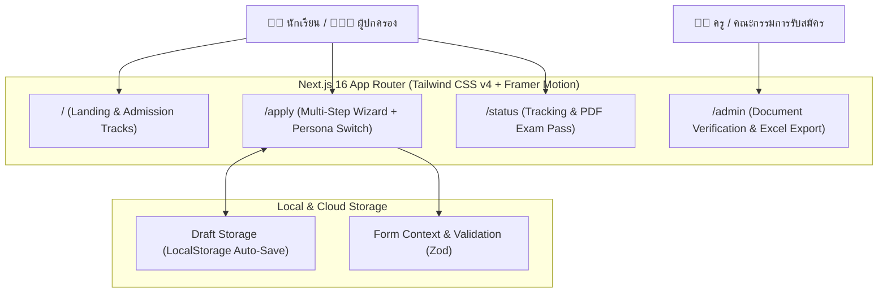
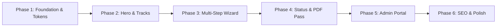

# 📋 Thasala Admission Portal — Development Plan & UI/UX Roadmap

> **เป้าหมาย:** สร้างระบบรับสมัครนักเรียนออนไลน์สำหรับ **โรงเรียนท่าศาลาประสิทธิ์ศึกษา** ที่มีความ **Dynamic**, อนิเมชันสวยงามลื่นไหล, ถ่ายทอดอัตลักษณ์สี **เทา-เหลือง** อย่างสง่างาม และที่สำคัญที่สุดคือ **ใช้งานง่าย ไม่รก ไม่ซับซ้อน** ทั้งสำหรับนักเรียนและผู้ปกครอง

---

## 🎯 ปรัชญาการออกแบบ (Design Philosophy & UX Principles)

จากแนวทาง **UI/UX Pro Max** และ **Design System**:

1. **Simplicity over Clutter (เรียบง่ายแต่ทรงพลัง):** 
   * แบ่งข้อมูลยาว ๆ ออกเป็นขั้นตอนย่อย (Progressive Disclosure) ไม่กองทุกอย่างในหน้าเดียว
   * ใช้ White Space อย่างเหมาะสม เพื่อให้สายตาโฟกัสข้อมูลสำคัญ (อ่านง่าย สบายตา)
2. **Dynamic Micro-Interactions (อนิเมชันที่มีความหมาย):**
   * ใช้ Framer Motion นำสายตาผู้ใช้ เช่น การเลื่อนเปลี่ยน Step ฟอร์มแบบ Directional Slide (ซ้าย-ขวา)
   * Micro-feedback: ปุ่มมี Loading state ชัดเจน, Hover Card ยกตัวขึ้นเบา ๆ (Lift effect), สำเร็จมี Checkmark เด้ง
   * เคารพการตั้งค่าผู้ใช้: รองรับ `prefers-reduced-motion` เพื่อการเข้าถึง (Accessibility)
3. **Dual Persona Tailored Experience:**
   * สลับโหมด **"นักเรียนสมัครเอง"** (เร็ว กระชับ สดใส) vs **"ผู้ปกครองสมัครให้"** (ฟอนต์ชัดเจน คำอธิบายภาษาทางการแต่อบอุ่น)
4. **Frictionless Status Tracking (ไร้รหัสผ่าน):**
   * ตรวจสอบสถานะและดาวน์โหลดบัตรสอบได้ทันทีด้วย **เลขบัตรประชาชน + วันเดือนปีเกิด**

---

## 🎨 Identity & Design Tokens (เทา - เหลือง)

### 1. Palette Specification

| ระดับ Token | รหัสสี (Hex) | CSS Token | การนำไปใช้ |
|:---|:---:|:---|:---|
| **School Charcoal** | `#0F172A` | `--color-slate-900` | ตัวหนังสือพาดหัวหลัก, Footer |
| **Deep Slate** | `#1E293B` | `--color-slate-800` | การ์ดข้อมูลหลัก, แถบสถานะทางการ |
| **Muted Slate** | `#64748B` | `--color-slate-500` | ตัวหนังสือคำอธิบาย, เส้นแบ่ง |
| **Soft Background** | `#F8FAFC` | `--color-slate-50` | พื้นหลังของเว็บ ไม่แสบตา |
| **Golden Amber** | `#F59E0B` | `--color-amber-500` | สีเน้นหลัก (Accent), ปุ่ม CTA, Highlight |
| **Deep Gold** | `#D97706` | `--color-amber-600` | สถานะ Hover ของปุ่ม, ไอคอนสำคัญ |
| **Warm Gold Surface** | `#FEF3C7` | `--color-amber-100` | Badge แผนการเรียน, แถบแจ้งเตือนไฮไลต์ |

### 2. Typography Scale (รองรับภาษาไทยสวยงาม)
* **Heading & Display:** `Prompt` / `Kanit` (น้ำหนัก 600, 700) ให้ความรู้สึกทันสมัย มีพลัง มั่นใจ
* **Body & Form:** `Sarabun` / `Inter` (น้ำหนัก 400, 500) อ่านง่าย สบายตา ความสูงบรรทัด (Line-height) 1.6
* **Form Inputs:** ขนาดฟอนต์ 16px ขึ้นไปบน Mobile เพื่อป้องกัน iOS ซูมหน้าจออัตโนมัติ

---

## 📐 สถาปัตยกรรมระบบ (System Architecture)

---

## 🗺️ แผนการพัฒนา 6 เฟส (Phased Roadmap)

---

### 🚀 Phase 1: Foundation & Design System Setup
> **เป้าหมาย:** วางรากฐาน UI Tokens, ติดตั้ง Core Libraries และทำ Shared Layout (Navbar & Footer)

* **Tasks:**
  * [ ] ติดตั้ง `framer-motion`, `lucide-react`, `clsx`, `tailwind-merge`, `zod`
  * [ ] กำหนดค่า Color Tokens (เทา-เหลือง) ใน `src/app/globals.css`
  * [ ] สร้าง Shared Components:
    * `Navbar.tsx`: โลโก้โรงเรียน, เมนูกำหนดการ, ปุ่มลัด "ตรวจสอบสถานะ" และ "สมัครเรียน"
    * `Footer.tsx`: ข้อมูลติดต่อ รร.ท่าศาลาประสิทธิ์ศึกษา, คำขวัญ, แผนที่ และ Social Links
    * `Badge.tsx`, `Button.tsx`: ปุ่ม Interactive มี Hover Lift effect
* **Branch:** `chore/setup-design-system`
* **Priority:** 🔴 High

---

### ✨ Phase 2: Landing Page & Program Showcase (`/`)
> **เป้าหมาย:** หน้าแรกที่กระชับ ไม่รก มีพลัง ดึงดูดสายตาด้วยอนิเมชัน และบอกข้อมูลที่จำเป็นครบถ้วน

* **Tasks:**
  * [ ] **Hero Section:**
    * Headline แบบ Staggered Animation ("ก้าวสู่อนาคตการศึกษา ณ โรงเรียนท่าศาลาประสิทธิ์ศึกษา")
    * Live Countdown Timer นับถอยหลังวันเปิดรับสมัคร/ปิดรับสมัคร
    * ปุ่ม CTA เด่นชัด (สมัครเรียน ม.1 / ม.4)
  * [ ] **Admission Track Cards (การ์ดเลือกหลักสูตร):**
    * ม.1: ห้องเรียนพิเศษ (SMTP, EP) และห้องเรียนปกติ
    * ม.4: ห้องเรียนพิเศษ (SMTP, EP, CNP, DEP) และแผนการเรียนปกติ (วิทย์-คณิต, ศิลป์-คำนวณ ฯลฯ)
    * แสดงเกณฑ์ GPAX ขั้นต่ำและจำนวนที่เปิดรับในรูปแบบการ์ดแบบ Interactive
  * [ ] **Interactive Admission Timeline:**
    * เส้นเวลาแสดง 5 ช่วง: รับสมัคร → สอบคัดเลือก → ประกาศผล → รายงานตัว → มอบตัว
    * แสดงสถานะปัจจุบัน (กำลังเปิดรับ / เร็ว ๆ นี้ / สิ้นสุด)
  * [ ] **FAQ Accordion:** คำถามที่พบบ่อย (ค่าใช้จ่าย, เอกสารที่ต้องใช้)
* **Branch:** `feat/landing-page`
* **Priority:** 🔴 High

---

### 📝 Phase 3: Dual-Mode Smart Application Wizard (`/apply`)
> **เป้าหมาย:** ฟอร์มรับสมัครที่กรอกง่ายที่สุดในโลก ไม่หลงทาง ไม่ตกหล่น ปลอดภัย

* **Tasks:**
  * [ ] **Persona Switcher:**
    * สลับระหว่าง "ฉันคือนักเรียน" และ "ฉันคือผู้ปกครองสมัครให้บุตรหลาน"
    * ปรับเปลี่ยนข้อความแนะนำ (Microcopy) ให้เหมาะสมกับผู้ใช้
  * [ ] **Step 1: เลือกแผนการเรียน (Track Selection):**
    * เลือก ม.1 หรือ ม.4 พร้อมเลือกอันดับแผนการเรียน
    * ตรวจสอบเงื่อนไข GPAX เบื้องต้น
  * [ ] **Step 2: ข้อมูลส่วนตัว & การศึกษา (Personal & Education):**
    * ข้อมูลผู้สมัคร (เลขบัตร ปชช., ชื่อ-สกุล, วันเกิด, ศาสนา, กรุ๊ปเลือด)
    * ข้อมูลโรงเรียนเดิมและผลการเรียนเฉลี่ย
    * ข้อมูลบิดา-มารดา หรือผู้ปกครอง
  * [ ] **Step 3: แนบเอกสารหลักฐาน (Document Upload):**
    * Drag & Drop รูปถ่ายหน้าตรงชุดนักเรียน (1.5 นิ้ว) พร้อมกรอบ Crop รูป
    * แนบไฟล์ ปพ.1 (ระเบียนแสดงผลการเรียน) ด้านหน้า-หลัง
    * แนบสำเนาทะเบียนบ้าน
    * ระบบพรีวิวไฟล์ทันที + ตรวจขนาดไฟล์ไม่เกินกำหนด (ป้องกันส่งไม่ผ่าน)
  * [ ] **Step 4: สรุปและยืนยันข้อมูล (Review & Confirm):**
    * หน้าสรุปข้อมูลทั้งหมดเป็นการ์ดอ่านง่าย
    * Checkbox ยืนยันความถูกต้องของข้อมูล
  * [ ] **Quality of Life Features:**
    * Auto-save Draft ลง `LocalStorage` (ปิดแท็บหรือเน็ตหลุดไม่หาย)
    * Smooth Step Transitions (Framer Motion Slide)
* **Branch:** `feat/application-wizard`
* **Priority:** 🔴 High

---

### 🔍 Phase 4: Status Tracking & PDF Exam Pass (`/status`)
> **เป้าหมาย:** ผู้สมัครติดตามสถานะได้เองทุกที่ทุกเวลา และพิมพ์บัตรเข้าห้องสอบได้ทันที

* **Tasks:**
  * [ ] **No-password Lookup Form:**
    * ค้นหาด้วย **เลขประจำตัวประชาชน (13 หลัก)** + **วันเดือนปีเกิด**
  * [ ] **Application Status Tracker:**
    * แสดงสถานะ 4 ระดับ: 
      1. ยื่นใบสมัครแล้ว (Submitted)
      2. กำลังตรวจสอบเอกสาร (Under Review)
      3. ผ่านการตรวจสอบ / มีสิทธิ์สอบ (Approved)
      4. เอกสารต้องแก้ไข (Action Required พร้อมแจ้งสาเหตุชัดเจน)
  * [ ] **Printable PDF Exam Pass (บัตรประจำตัวผู้เข้าสอบ):**
    * เลย์เอาต์ขนาด A4 สำหรับพิมพ์หรือเซฟเป็นไฟล์ PDF
    * ประกอบด้วย: ตราโรงเรียน, รูปถ่ายผู้สมัคร, เลขที่นั่งสอบ, ห้องสอบ, แผนการเรียน, และ QR Code ยืนยันตัวตน
* **Branch:** `feat/status-tracking`
* **Priority:** 🟡 Medium

---

### 🛡️ Phase 5: Admin & Committee Verification Portal (`/admin`)
> **เป้าหมาย:** ให้ครูผู้ตรวจเอกสารทำงานได้รวดเร็วที่สุด ลดภาระงานเอกสาร

* **Tasks:**
  * [ ] **Applicant Roster Table:**
    * ตารางรายชื่อผู้สมัคร กรองตามชั้น (ม.1/ม.4), แผนการเรียน, และสถานะเอกสาร
    * ค้นหาด่วนด้วยชื่อหรือเลขบัตรประชาชน
  * [ ] **Side-by-Side Verification Modal:**
    * แสดงข้อมูลที่กรอกฝั่งซ้าย และเอกสารแนบ (ปพ.1, รูปถ่าย) ฝั่งขวา เพื่อตรวจเทียบได้ทันทีในคลิกเดียว
    * ปุ่มกด 1-Click: "อนุมัติ" หรือ "ส่งกลับแก้ไข" (เลือกเหตุผล เช่น รูปไม่ชัด, เอกสารไม่ครบ)
  * [ ] **Data Export:**
    * ส่งออกรายชื่อผู้สมัครและคะแนนเป็น Excel/CSV รองรับภาษาไทย 100%
  * [ ] **Analytics Overview:**
    * สรุปยอดผู้สมัครแต่ละแผนการเรียนแบบเรียลไทม์
* **Branch:** `feat/admin-portal`
* **Priority:** 🟡 Medium

---

### ⚡ Phase 6: Performance, SEO & Quality Assurance
> **เป้าหมาย:** เว็บโหลดไวคะแนน Web Vitals สีเขียวทุกตัว และแสดงตัวอย่างลิงก์สวยงามบน Facebook/LINE

* **Tasks:**
  * [ ] **Core Web Vitals Optimization:**
    * LCP < 2.5s, CLS < 0.1, FID/INP < 100ms
    * บีบอัดรูปภาพด้วย Next.js `<Image />` เป็น WebP/AVIF อัตโนมัติ
  * [ ] **Social Share & SEO Meta:**
    * OpenGraph Tags สำหรับแชร์ใน Facebook และ LINE (ภาพแบนเนอร์ประชาสัมพันธ์โรงเรียน)
    * Schema.org Structured Data (`EducationalOrganization`)
  * [ ] **Cross-Device Testing:**
    * ทดสอบบนมือถือ (iPhone Safari, Android Chrome) ความกว้าง 375px ขึ้นไป
* **Branch:** `chore/seo-optimization`
* **Priority:** 🟢 Low

---

## 📋 Checklist ควบคุมคุณภาพก่อนส่งมอบ (Quality Gate)

- [ ] **School Identity:** คุมโทนสีเทา-เหลือง (Slate & Amber) สม่ำเสมอ ไม่หลุดธีม
- [ ] **No Clutter:** ไม่มีหน้าจอไหนที่มีตัวอักษรแออัดจนตาลาย มีระยะเว้น (Whitespace) โปร่งสบาย
- [ ] **Mobile-First:** ใช้งานฟอร์มและแนบไฟล์บนมือถือได้ลื่นไหล 100%
- [ ] **Accessibility:** คอนทราสต์สีตัวหนังสือผ่านเกณฑ์ WCAG 4.5:1, ปุ่มกดมีขนาดขั้นต่ำ 44×44px
- [ ] **Git Discipline:** แตก branch ตามงาน, ใช้ Conventional Commits, รวมผ่าน PR
